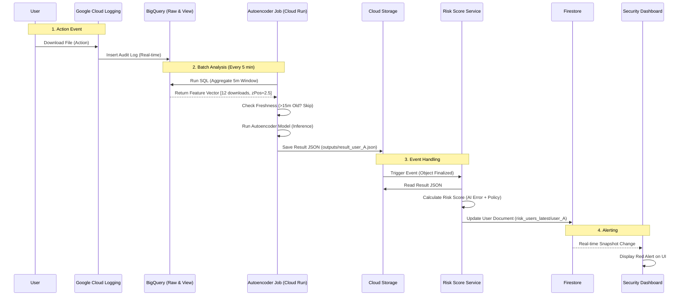

# OmniHub Intelligent Security Pipeline Architecture

## 1. System Overview (시스템 개요)
This document outlines the end-to-end architecture of the OmniHub Intelligent Security System. It automates user behavior analysis using BigQuery, Cloud Run, and Autoencoder models to detect anomalies and update risk scores in real-time.

---

## 2. Full Architecture Diagram (전체 아키텍처)

```mermaid
graph TD
    %% 1. Data Ingestion
    User((User Activity)) -->|Generates Log| LogRouter[Log Router]
    LogRouter -->|Sink| BQ_Raw[(BigQuery: audit_logs_raw)]
    
    %% 2. Data Processing (SQL)
    subgraph "Data Processing Layer (BigQuery)"
        BQ_Raw -->|View: Clean| BQ_Clean[TB_CLEAN_AUDIT]
        BQ_Clean -->|View: Aggregate| BQ_User5m[TB_USER_5M]
        BQ_User5m -->|View: Features| BQ_Vector[TB_VECTOR]
    end

    %% 3. Analysis Pipeline (Batch Job)
    subgraph "Analysis Layer (Cloud Run Job - 5min)"
        Scheduler((Cloud Scheduler)) -->|Trigger| Job[Autoencoder Risk Job]
        Job -->|Run SQL| BQ_Vector
        Job -->|Export CSV| GCS_In[GCS: inputs/*.csv]
        Job -->|Inference (Model)| Model{Autoencoder Model}
        Model -->|Generate Result| GCS_Out[GCS: outputs/*.json]
        
        %% Freshness Check Logic
        Job -- Check Data Time --> BQ_Vector
        Job -- If > 15m Old --> Skip[Skip Analysis]
    end

    %% 4. Event Processing & Scoring
    subgraph "Scoring Layer (Event-Driven)"
        GCS_Out -->|Trigger| Eventarc((Eventarc))
        Eventarc -->|Invoke| Service[Risk Score Service]
        Service -->|Calculate Score| Logic[Risk Engine]
        Logic -->|Get History| FS_Read[(Firestore)]
        Logic -->|Update| FS_Write[(Firestore: risk_users_latest)]
    end

    %% 5. Visualization
    subgraph "Presentation Layer"
        FS_Write -->|Real-time Sync| Dashboard[Security Dashboard]
    end
```

---

## 3. Component Details (상세 구성요소)

### 3.1 Data Ingestion & Processing
*   **Log Router**: Collects audit logs from GCP services.
*   **BigQuery**:
    *   `audit_logs_raw`: Raw log storage.
    *   `TB_USER_5M`: Aggregates user actions every 5 minutes (Downloads, Denies, etc.).
    *   `TB_VECTOR`: Feature vector table for ML input.

### 3.2 Analysis Pipeline (Cloud Run Job)
*   **Name**: `autoencoder-risk-job`
*   **Schedule**: Every 5 minutes (via Cloud Scheduler).
*   **Logic**:
    1.  **Freshness Check**: Skip if data is older than 15 minutes.
    2.  **Export Input**: Save current feature vector to `gs://aib-riskscore/inputs/`.
    3.  **Inference**:
        *   Load Model (`autoencoder.keras`) from GCS.
        *   Predict Reconstruction Error.
    4.  **Export Output**: Save results to `gs://aib-riskscore/outputs/` as JSON.

### 3.3 Risk Scoring Service (Cloud Run Service)
*   **Name**: `risk-score-service`
*   **Trigger**: Eventarc (on GCS Object Finalize in `outputs/`).
*   **Logic**:
    *   Reads JSON result from GCS.
    *   Calculates final `Risk Score` (0-100) combining AI error & Policy rules.
    *   **Idempotency**: Prevents duplicate processing using `ingestions` collection.
    *   **Upsert**: Updates `risk_users_latest/{userId}` document.

---

## 4. End-to-End Data Flow (데이터 흐름 순서)

### Sequence of Events: Anomaly Detection


---

## 5. Data Flow & Schema (데이터 구조)

### 4.1 Input Feature Vector (Example)
| Field | Value | Description |
| :--- | :--- | :--- |
| `userId` | `user@example.com` | User Identifier |
| `userDownloads5m` | `12` | Total downloads in 5 min |
| `zPos` | `2.5` | Deviation from dept average |

### 4.2 Output Result JSON (`outputs/`)
```json
{
  "userId": "user@example.com",
  "reconError": 2.5,
  "anomalyScore": 1.2,
  "metadata": {
    "userDownloads5m": 12,
    "zPos": 2.5
  }
}
```

### 4.3 Firestore Document (`risk_users_latest`)
```json
{
  "userId": "user@example.com",
  "riskScore": 85,
  "defconMode": "ALERT",
  "reconError": 2.5,
  "lastEventAt": "2024-02-08T14:30:00Z"
}
```

---

## 5. Key Features (핵심 기능)
1.  **Automated Execution**: Runs every 5 mins without manual intervention.
2.  **Efficient Processing**: Skips analysis if no new data exists (Cost saving).
3.  **Scalable Inference**: Batch processing handles thousands of users at once.
4.  **Real-time Alerting**: Firestore updates trigger instant dashboard alerts.
